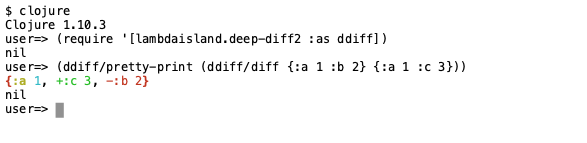
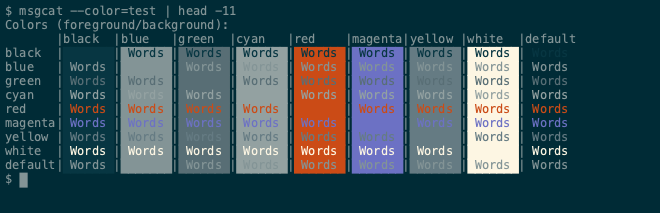

# membrane.term

A simple terminal emulator in clojure.

## Rationale

I thought it would be fun. There's not much code. All of the ANSI parsing work is done by [asciinema/vt](https://github.com/asciinema/vt). `membrane.term` is just small UI on top.

Some reasons to use **membrane.term**:
- If you need to programmatically control, inspect, drive, or manipulate a terminal
- If you want to learn more about how terminal emulators work
- If you'd like to embed a terminal somewhere. There's not really a guide for embedding, but if you file an issue, I can provide some tips
- If you'd like to capture terminal screenshots for documentation

## Installation

Membrane.term works on macOS and Linux operating systems.

To invoke via `clj -M:membrane.term` add the following alias to your `deps.edn`:
```Clojure
{:aliases
 {:membrane.term
  {:replace-deps
   {com.phronemophobic/membrane.term {:git/url "https://github.com/phronmophobic/membrane.term.git"
                                      :git/sha "7b973adc4910729042736d8a84e5fce4f4f43722"}
    ;; the next 2 optional deps appease pty4j which does some logging
    ;; change nop to simple if you'd actually like to see the log lines
    org.slf4j/log4j-over-slf4j {:mvn/version "1.7.32"}
    org.slf4j/slf4j-nop {:mvn/version "1.7.32"}}
   :main-opts ["-m" "com.phronemophobic.membrane.term.main"]}}
 :mvn/repos
 ;; pty4j is currently only available from the jetbrains maven repo
 {"jetbrains-intellij-dependencies" {:url "https://packages.jetbrains.team/maven/p/ij/intellij-dependencies"}}}
```

## Command Line Usage

For usage help run:
```bash
clj -M:membrane.term --help
```

### Run an interactive GUI terminal

```bash
clj -M:membrane.term run-term
```

A demo of the types of things you can do:


You can also optional specify:
- `-w, --width` width of the terminal window in character columns (default: 90)
- `-h, --height` height of the terminal window in character rows (default: 30)
- [`--color-scheme`](#color-schemes) choose a different color scheme
- [`--font-family`](#fonts) choose an OS installed font (default: monospace)
- [`--font-size`](#fonts) specify font point size (default: 12)
- [`--toolkit`](#toolkits) specify the toolkit (default: java2d)

### Run a headless terminal and take a screenshot

Play a script in a headless terminal and write an image to terminal.png.

Given play script `play-msgcat.sh`:
<!-- copied from doc/examples/play-msgcat.sh -->
```bash
# override prompt to something doc-friendly
export PS1="$ "
# print out some  colors
clear
msgcat --color=test | head -11
```

If we run:
```
clj -M:membrane.term screenshot --play play-msgcat.sh --height 14
```

Membrane.term passes the script to the terminal character by character, then writes a screenshot to `terminal.png`:

<!-- generated by script/regen-screenshots.sh -->


You must specify:
- `-p, --play` script to play

You can also optionally specify:
- `-w, --width` width of the terminal window in character columns (default: 90)
- `-h, --height` height of the terminal window in character columns (default: 30)
- `-o, --out` filename of the image file to generate (default: terminal.png)\
Image format determined by filename extension, supported extensions are `.png`, `.webp`, `.jpeg` and `.jpg`.
- [`--color-scheme`](#color-schemes) choose a different color scheme
- [`--font-family`](#fonts) choose an OS installed font (default: monospace)
- [`--font-size`](#fonts) specify font point size (default: 12)
- [`--toolkit`](#toolkits) specify the toolkit (default: java2d)
- `--line-delay` if your play script runs a command like `lein repl`, the underlying program might not be ready to accept input immediately.\
You can specify a delay in ms to wait after each line is played to the terminal (default: 1000)
- `--final-delay` after the last line of your play script is run, you might need to wait for it to generate all of its output.\
You can specify a delay in ms to wait after the entire script has been played to the terminal  (default: 10000)

Given play script `play-deep-diff.sh`:
<!-- copied from doc/examples/play-deep-diff.sh -->
```bash
# our setup
export PS1="$ "
cd
mkdir -p target/term-screenshot
cd target/term-screenshot
echo '{:deps {lambdaisland/deep-diff2 {:mvn/version "2.0.108"}}}' > deps.edn
# we clear to wipe setup output
clear
clojure
(require '[lambdaisland.deep-diff2 :as ddiff])
(ddiff/pretty-print (ddiff/diff {:a 1 :b 2} {:a 1 :c 3}))
```
Let's increase the line delay to give the Clojure REPL a chance to start up before feeding it input.
We'll also reduce the final delay, we just don't need 10 seconds for this one:
```bash
clj -M:membrane.term screenshot --play play-deep-diff.sh \
  --width 80 --height 9 \
  --final-delay 1000 --line-delay 3000 \
  --out deep-diff.jpg
```
Produces `deep-diff.jpg`:
<!-- generated by script/regen-screenshots.sh -->


## Color Schemes

There are boatloads of terminal color schemes available at [iTerm2-Color-Schemes](https://github.com/mbadolato/iTerm2-Color-Schemes).
Review what you might like [from their screenshots](https://github.com/mbadolato/iTerm2-Color-Schemes#screenshots), then find the corresponding [`.itermcolors` file under their schemes directory](https://github.com/mbadolato/iTerm2-Color-Schemes/tree/master/schemes).

Use the `--color-scheme` option to specify an `.itermcolors` file, either from a copy you have downloaded:

```bash
clj -M:membrane.term run-term --width 90 --height 30 \
  ---color-scheme "Builtin Solarized Dark.itermcolors"
```

...or directly from the raw GitHub URL:

```bash
clj -M:membrane.term screenshot --play play-msgcat.sh --height 14 \
  --color-scheme "https://raw.githubusercontent.com/mbadolato/iTerm2-Color-Schemes/master/schemes/Builtin%20Solarized%20Dark.itermcolors"
```
The screenshot command produces `terminal.png`:
<!-- generated by script/regen-screenshots.sh -->


## Fonts

You can specify a font family and size.
The font must be OS installed and is assumed to be monospace.

Let's pretend that, for whatever reason, you've fallen in love with the [Nova Mono font](https://fonts.google.com/specimen/Nova+Mono), and have installed it on your system.

To use this font in an interactive membrane.term terminal, specify its installed name. Here we've opted for a point size of 16:
```bash
clj -M:membrane.term run-term --font-family "NovaMono" --font-size 16
```

The same options are available for screenshots:
```bash
clj -M:membrane.term screenshot --play play-msgcat.sh --height 14 \
  --font-family "NovaMono" --font-size 16
```

produces `terminal.png`:
<!-- generated by script/regen-screenshots.sh -->


## Toolkits

You can specify a toolkit. Available options are "java2d" (the default) and "skia".

### Java2d

The java2d toolkit will use swing for windowing, graphics, and events.

### Skia

The skia toolkit will use [skia](https://skia.org/) for graphics and [glfw](https://www.glfw.org/) for windowing and events. Using the skia toolkit requires the following extra dependency:

M1 mac:
```clojure
com.phronemophobic.membrane/skialib-macosx-aarch64 {:mvn/version "0.9.31.0-beta"}
```

Non-M1 mac:
```clojure
com.phronemophobic.membrane/skialib-macosx-x86-64 {:mvn/version "0.9.31.0-beta"}
```

Linux
```clojure
com.phronemophobic.membrane/skialib-linux-x86-64 {:mvn/version "0.9.31.0-beta"}
```

If running from the `membrane.term` project, you can use the `:skia` alias to add the dependency:

```bash
clojure -M:membrane.term:skia run-term --toolkit skia
```

## Discuss

Questions? Comments? Connect with us on clojurians slack in [#membrane-term](https://clojurians.slack.com/archives/C02KE09HMHV) (join [here](http://clojurians.net/))

## License

Copyright © 2021 Adrian Smith

Distributed under the Eclipse Public License version 1.0.
